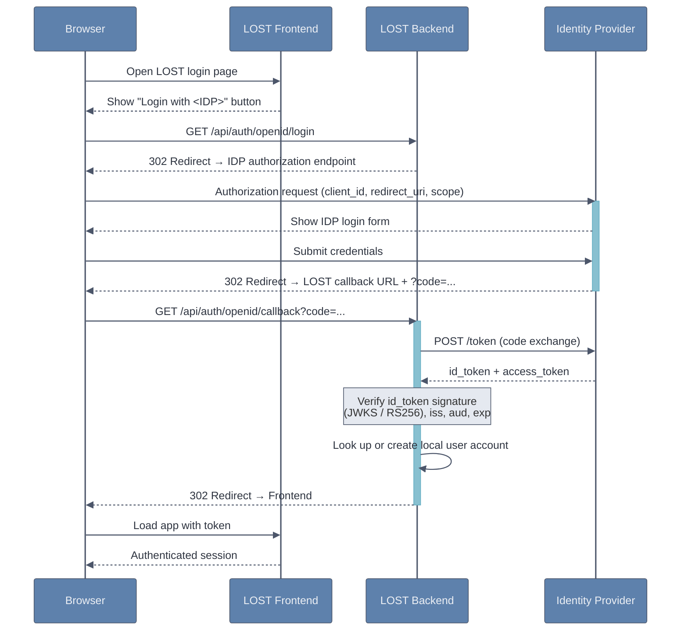

# OpenID Connect

LOST supports authentication via an external Identity Provider (IDP) using the
[OpenID Connect](https://openid.net/developers/how-connect-works/) (OIDC) protocol.
Once configured, a dedicated login button appears on the LOST login page and users
are redirected to the IDP for authentication. On first login, LOST automatically
creates a local account with the **Annotator** role. Subsequent logins reuse the
existing account.

:::note
LOST's OIDC integration has been developed and tested against
[Authentik](https://goauthentik.io/). Other OIDC-compliant providers should work
as well, but may require minor adjustments to the endpoint path variables.
:::

## Authentication Flow



## IDP Setup

Before configuring LOST, register an OAuth2/OIDC application in your IDP:

1. Create an **OAuth2 Provider** with the **Authorization Code** flow.
2. Set the **Redirect URI** (callback URL) to:

   ```
   https://<your-lost-domain>/api/auth/openid/callback
   ```

3. Note down the **Client ID**, **Client Secret**, and the **base URL** of your IDP.
4. Ensure the IDP issues `id_token`s containing the following claims:
   - `preferred_username` *(required)* — used as the LOST username
   - `email` *(optional)*
   - `given_name` / `family_name` or `name` *(optional)*

## Environment Variables

Add the following variables to your `.env` file:

```bash
# Base URL of your Identity Provider
LOST_OPENID_URL=https://auth.example.com

# OAuth2 client credentials registered at the IDP
LOST_OPENID_CLIENT_ID=your-client-id
LOST_OPENID_CLIENT_SECRET=your-client-secret

# Callback URL – must match the Redirect URI registered at the IDP
LOST_OPENID_REDIRECT_URI=https://<your-lost-domain>/api/auth/openid/callback

# Slug of the OIDC application at the IDP (used to construct the JWKS endpoint)
# For Authentik: the application slug shown in the application settings
LOST_OPENID_APP_SLUG=lost

# JWT verification settings (defaults work for Authentik with RS256)
LOST_JWT_ALGORITHM=RS256
LOST_JWT_ISSUER=https://auth.example.com/application/o/lost/

# Public URL of the LOST frontend (used for the post-login redirect)
LOST_FRONTEND_URL=https://<your-lost-domain>
```

Additionally, set the following variable in your frontend environment (e.g. in your
`docker-compose.yml` as a build argument or in your Vite `.env` file). This controls
the label shown on the login button. **If this variable is not set, the OIDC login
button is hidden and OIDC authentication is disabled.**

```bash
VITE_LOST_OPENID_NAME=My IDP
```

### Variable Reference

| Variable | Required | Description |
|---|---|---|
| `LOST_OPENID_URL` | Yes | Base URL of the IDP (e.g. `https://auth.example.com`) |
| `LOST_OPENID_CLIENT_ID` | Yes | OAuth2 client ID registered at the IDP |
| `LOST_OPENID_CLIENT_SECRET` | Yes | OAuth2 client secret |
| `LOST_OPENID_REDIRECT_URI` | Yes | Callback URL; must match the Redirect URI registered at the IDP |
| `LOST_OPENID_APP_SLUG` | Yes | Application slug at the IDP; used to build the JWKS URI (`{LOST_OPENID_URL}/application/o/{slug}/jwks/`) |
| `LOST_JWT_ALGORITHM` | No | Algorithm for `id_token` verification. Default: `RS256` |
| `LOST_JWT_ISSUER` | No | Expected `iss` claim in the `id_token`. Default: `{LOST_OPENID_URL}/application/o/lost/` |
| `LOST_FRONTEND_URL` | Yes | Public URL of the LOST frontend; used for the post-login redirect |
| `VITE_LOST_OPENID_NAME` | Yes | Display name shown on the login button; **omitting this disables OIDC** |

## User Management

- Users logging in via OIDC for the **first time** are automatically created with the **Annotator** role.
- To assign a different role, use the **User Management** section in the Admin Area.
- LOST matches accounts by `preferred_username`. If a local account with the same username already exists, the OIDC login will use that existing account.

:::warning
If a local account with the same `preferred_username` already exists, that account
will be used for the OIDC login. Make sure usernames are consistent between your
IDP and any pre-existing local LOST accounts to avoid unintended account takeovers.
:::
